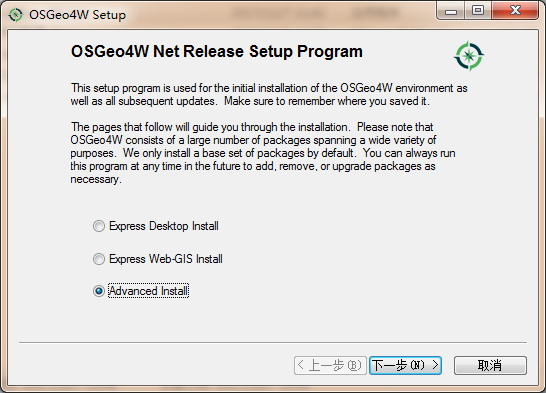
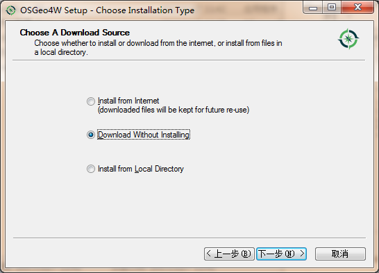

QGis版本采用[2.14(LTR)](https://github.com/qgis/QGIS/tree/release-2_14)，该版本对Qt4的支持比较好。编译参考：[QGis官方编译文档]( https://htmlpreview.github.io/?https://raw.github.com/qgis/QGIS/master/doc/INSTALL.html#toc13 )

<!--more-->

## 安装vs2010

## 安装并配置Qt
- 安装[Qt4.8.6]( http://download.qt.io/archive/qt/ )，默认位置是C:\Qt\4.8.6。
配置环境变量QTDIR=C:\Qt\4.8.6

- 安装[qt-vs-addin-1.1.11]( http://download.qt.io/archive/vsaddin/ )，该版本对应vs2010。

## 安装辅助工具

- 下载并安装[cmake]( https://cmake.org/ )
- 下载[cygwin]( https://cygwin.com/ )
在选择安装包的页面，选择bison、flex、git，在搜索框中输入关键字后，出现多个安装包，不知道具体的安装包情况，可以选择所有的安装包。

- 下载[OSGeo4W]( http://trac.osgeo.org/osgeo4w/ )，OSGeo4W是最关键的工具，可以下载编译依赖的头文件以及库函数。

#### OSGeo4W安装

1.	点击运行 osgeo4W-setup-x86.exe，选择Adavanced install(二次开发选项)，点击【下一步】；

2.	选择“Download Without Installing”，下载离线安装包，点击【下一步】；

4.	设置离线包存放目录，点击【下一步】；
5.	直接点击【下一步】

6.	选择下载地址，点击【下一步】；

7.	选择安装包
expat,fcgi,gdal,grass,gsl-devel,iconv,libzip-devel,libspatialindex-devel,pyqt4,python3-devel,python3-qscintilla,python3-nose2,python3-future,python3-pyyaml,python3-mock,python3-six,qca-devel,qca-libs,qscintilla,qwt-devel,sip,spatialite,oci,libzip-devel

8.	选择同意协议，点击【下一步】；
9.	下载完成。

