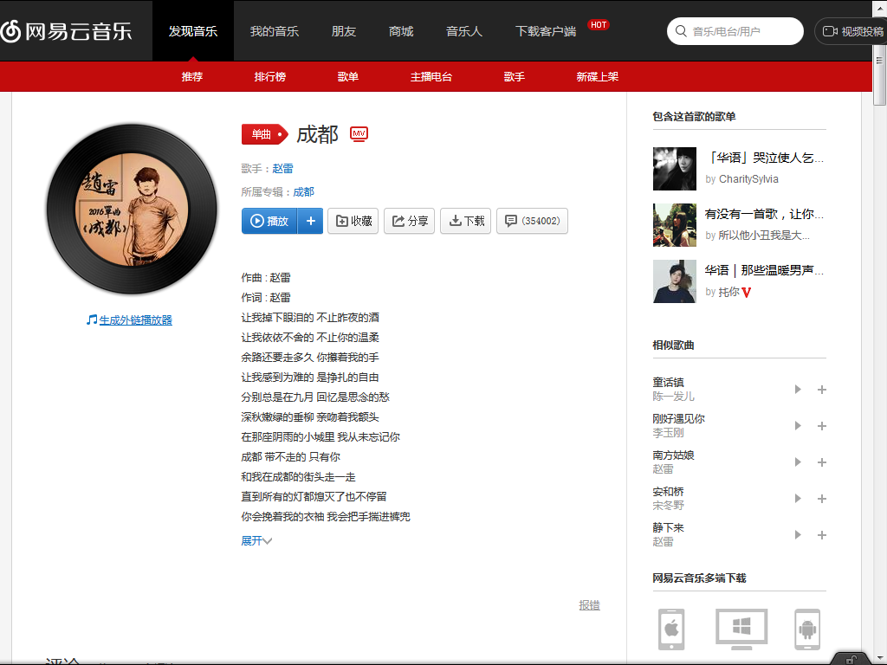
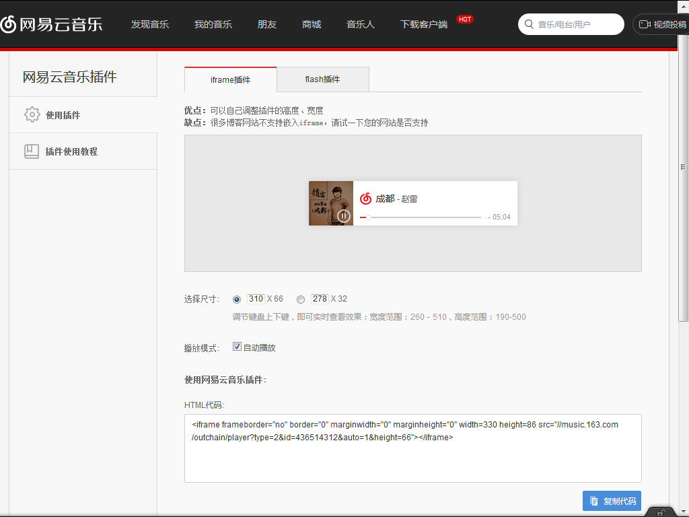

## 插入图片

1.安装插件(管理员权限),打开命令终端，输入命令：`npm install hexo-asset-image –-save`；
2.打开hexo初始化目录下的** _config.yml ** ，查找到关键字** post_asset_folder **，将其默认值** false **更改为** true ** (注意空格)。

<!--more-->

#### 示例
- 新建博客，输入命令：`Hexo new image`（在/source/_posts目录下生成** image.md **和** image文件夹 **。
- 在** image文件夹 **下放入一张图片，如：1.jpg。
- 打开** image.md **文档，在正文输入图片``**
- 上面插入的是本地图片，还可以插入网络图片，如``
> 插入图片的语法：
``

## 插入音乐
插入网易云音乐的歌曲链接，浏览器中打开[网易云音乐](http://music.163.com/),点击需要插入的歌曲(如：成都)，点击左侧“生成外链播放器”，调整属性值。复制HTML代码，粘贴到博客的相应位置即可。

`<iframe frameborder="no" border="0" marginwidth="0" marginheight="0" width=330 height=86 src="//music.163.com/outchain/player?type=2&id=436514312&auto=1&height=66"></iframe> `

